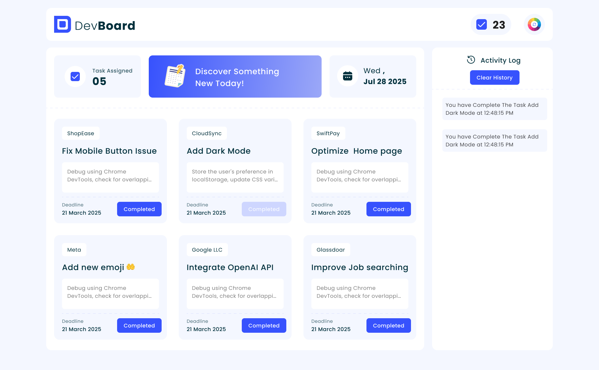

# DevBoard

DevBoard is a demo web template that allows you to create a personalized dashboard for your projects. It includes a responsive layout, a clean and modern design, and a variety of interactive components.

## Features

- Responsive layout: DevBoard is designed to adapt to different screen sizes, ensuring a seamless user experience on desktops, tablets, and mobile devices.
- Clean and modern design: The template features a minimalist design with a focus on white space and a neutral color palette. This creates a clean and professional look that is easy on the eyes.
- Interactive components: DevBoard includes various interactive components such as buttons, forms, dropdowns, and modals. These components help users interact with the dashboard and perform tasks more efficiently.
- Customizable options: The template allows you to customize the dashboard by adding your own content, images, and styles. You can also change the color scheme and font styles to match your preferences.

